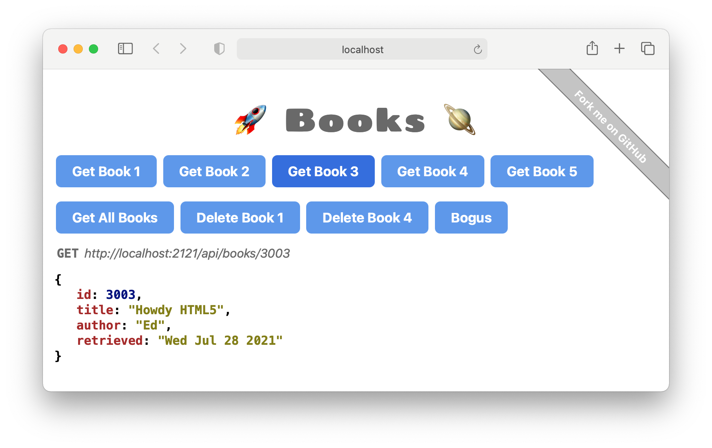

# simple-node-mvc-starter-project


_Simple Node.js MVC starter project_

[](https://github.com/dna-engine/simple-node-mvc-starter-project/actions/workflows/run-spec-on-push.yaml)

**STATUS:** Early development (not even pre-alpha)



Try it out:
```terminal
$ git clone https://github.com/dna-engine/simple-node-mvc-starter-project
$ cd simple-node-mvc-starter-project
$ npm install
$ npm run dev
```

To run just the API server:
```terminal
$ npm start
```
In your browser, open: http://localhost:2121/api/v1/books

<br>

---
[MIT License](LICENSE.txt)
